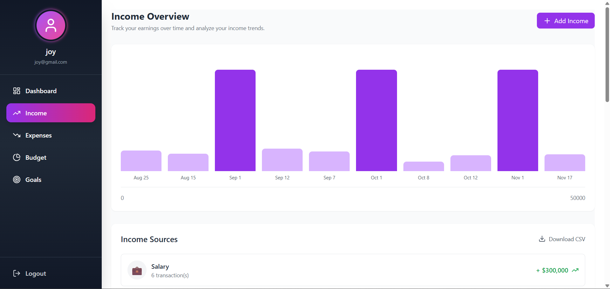
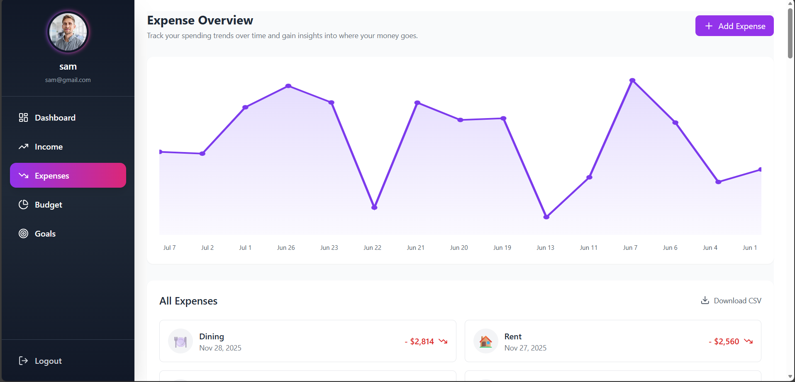
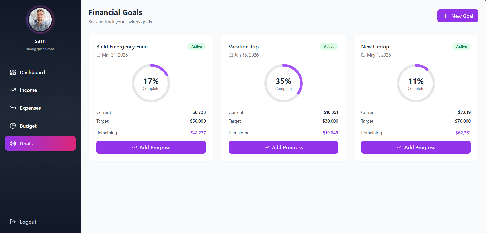

# Finance Tracker - Personal Finance Management System

A full-stack web application for tracking income, expenses, budgets, and financial goals. Built with React and Django REST Framework.


##  Features

### 📊 Dashboard
- Overview of total balance, income, and expenses
- Recent transactions display
- Financial overview with interactive donut chart
- **Analytics & Reports**:
  - Month-over-month comparison
  - Financial health score
  - 6-month income vs expense trends
  - Spending breakdown by category
  - Top 5 spending categories

### 💵 Income & Expense Tracking
- Add, edit, and delete transactions
- Categorize with custom icons
- Visual charts and graphs
- Export to CSV
- Filter and search capabilities

### 💳 Budget Management
- Set monthly budgets per category
- Real-time spending tracking
- Visual progress indicators
- Budget alerts (On Track, Warning, Over Budget)

### 🎯 Financial Goals
- Create savings goals
- Track progress with circular indicators
- Set target dates and amounts
- Pause/resume goals
- Achievement notifications

### 👤 User Management
- Secure authentication (JWT)
- Profile picture upload
- User-specific data isolation

---

## 🛠️ Tech Stack

### Frontend
- **React** 18.x
- **React Router** v6
- **Axios** for API calls
- **Tailwind CSS** for styling
- **Lucide React** for icons

### Backend
- **Django** 5.x
- **Django REST Framework**
- **Simple JWT** for authentication
- **SQLite** database (development)
- **Pillow** for image processing

---

## 🚀 Getting Started

### Prerequisites
- Node.js (v14 or higher)
- Python 3.8+
- pip
- Git

### Installation

#### 1. Clone the repository
```bash
git clone https://github.com/yourusername/finance-tracker.git
cd finance-tracker
```

#### 2. Backend Setup
```bash
cd backend

# Create virtual environment
python -m venv venv

# Activate virtual environment
# Windows
venv\Scripts\activate
# Mac/Linux
source venv/bin/activate

# Install dependencies
pip install -r requirements.txt

# Create database and migrate
python manage.py makemigrations
python manage.py migrate

# Create superuser (admin)
python manage.py createsuperuser

# Run development server
python manage.py runserver
```

Backend will run on `http://127.0.0.1:8000`

#### 3. Frontend Setup
```bash
cd ../frontend

# Install dependencies
npm install

# Start development server
npm start
```

Frontend will run on `http://localhost:3000`

---

## 📸 Screenshots

### Home Page


### Register Page


### Dashboard


### Income Tracking


### Expenses Tracking


### Financial Goals


---

## 📚 API Documentation

### Authentication
- `POST /api/register/` - Register new user
- `POST /api/token/` - Login (get JWT tokens)
- `POST /api/token/refresh/` - Refresh access token
- `GET /api/profile/` - Get user profile

### Transactions
- `GET /api/transactions/` - List all transactions
- `POST /api/transactions/` - Create transaction
- `PATCH /api/transactions/{id}/` - Update transaction
- `DELETE /api/transactions/{id}/` - Delete transaction

### Categories
- `GET /api/categories/` - List categories
- `POST /api/categories/` - Create category

### Budgets
- `GET /api/budgets/` - List budgets
- `POST /api/budgets/` - Create budget

### Goals
- `GET /api/goals/` - List goals
- `POST /api/goals/` - Create goal
- `PATCH /api/goals/{id}/` - Update goal

---

## 🔧 Configuration

### Environment Variables

Create a `.env` file in the backend directory:
```env
DEBUG=True
SECRET_KEY=your-secret-key-here
ALLOWED_HOSTS=localhost,127.0.0.1
DATABASE_URL=sqlite:///db.sqlite3
```

---

## 🤝 Contributing

Contributions are welcome.

1. Fork the repository
2. Create a feature branch (`git checkout -b feature/AmazingFeature`)
3. Commit your changes (`git commit -m 'Add some AmazingFeature'`)
4. Push to the branch (`git push origin feature/AmazingFeature`)
5. Open a Pull Request

---


## 👨‍💻 Author

**Your Name**
- GitHub: [@iam-Akshay-Kumar](https://github.com/iam-Akshay-Kumar)
- LinkedIn: [Akshay Kumar](https://linkedin.com/in/akshay-kumar-m-v)

---

⭐ **Star this repository if you found it helpful!**
